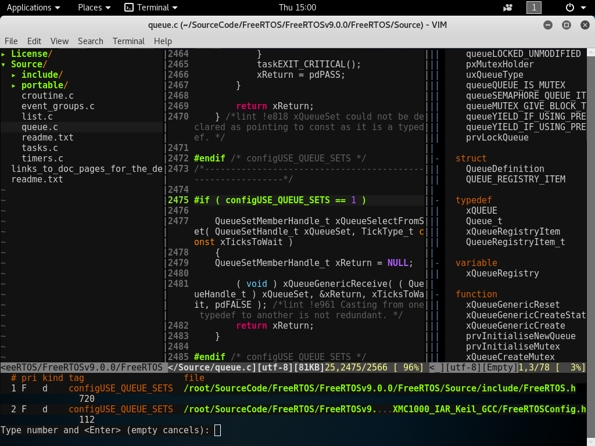

# .vimrc
## **[Goal]:**
Aim to edit/trace code easily with the text editor, **[Vim](http://www.vim.org/, "http://www.vim.org/")**. Before apply with this configurable file .vimrc, some plugins should be pre-installed.



## pathogen.vim
Refer to [pathogen.vim](https://github.com/tpope/vim-pathogen "https://github.com/tpope/vim-pathogen") for the installation, which makes it super easy to install plugins and runtime files in their own private directories.
```
mkdir -p ~/.vim/autoload ~/.vim/bundle && \
curl -LSso ~/.vim/autoload/pathogen.vim https://tpo.pe/pathogen.vim
```

Add this into .vimrc for runtime path manipulation
```
execute pathogen#infect()
```

## NERD Tree
Install plugin NERDTree from [nerdtree](https://github.com/scrooloose/nerdtree, "https://github.com/scrooloose/nerdtree") that allows you to explore the filesystem in a tree hierarchy and to open files and directories easily.
```
git clone https://github.com/scrooloose/nerdtree.git ~/.vim/bundle/nerdtree
```

## Tag List
``` sh
git clone https://github.com/vim-scripts/taglist.vim ~/.vim/tmp
mv ~/.vim/tmp/plugin ~/.vim/
mv ~/.vim/tmp/doc ~/.vim/
rm -rf ~/.vim/tmp
```

## Color Scheme

* Molokai
```
git clone https://github.com/tomasr/molokai ~/.vim/tmp
mkdir -p ~/.vim/colors
mv ~/.vim/tmp/colors/molokai.vim ~/.vim/colors
rm -rf ~/.vim/tmp
```
* torte
```
silent! colorscheme torte
```

## Cscope
```
apt-get install cscope
```
